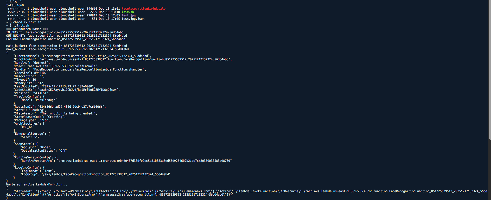
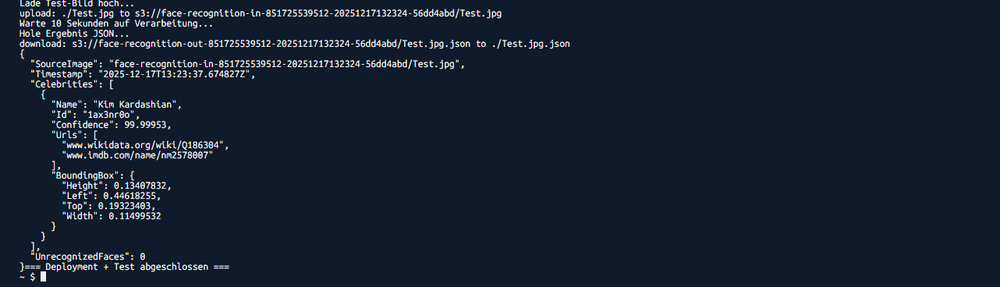
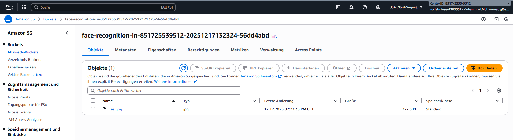
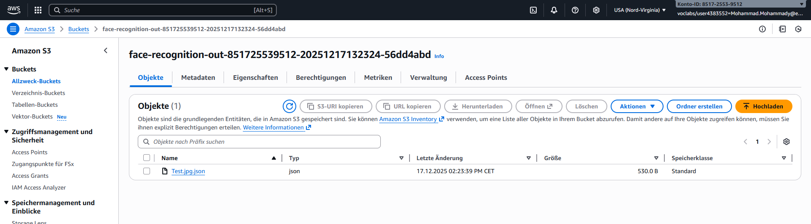
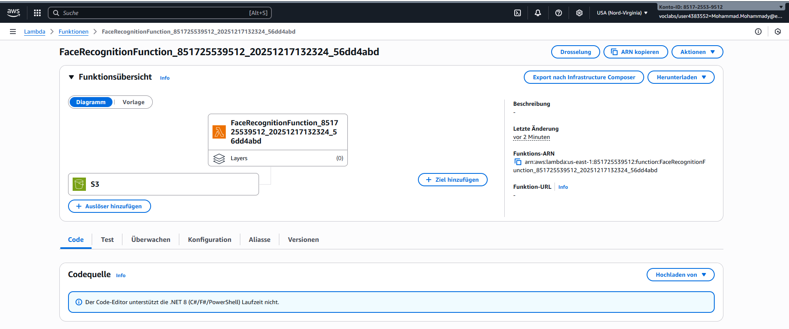

# FaceRecognition Projekt – Modul 346

**Projektgruppe:**  

- Finn (Dokumentation)
- Tom (Testing & Bucket-Setup)
- Mohammad (Scripting & Lambda-Entwicklung)

**Datum:** Dezember 2025  
**Repository:** <https://github.com/Gamesninja777/346-Projekt>

---

## Inhaltsverzeichnis

- [1. Projektübersicht](#1-projektübersicht)
- [2. Fachlicher Hintergrund](#2-fachlicher-hintergrund)
- [3. Architektur & Aufbau des Services](#3-architektur--aufbau-des-services)
- [4. Planung und Organisation](#4-planung-und-organisation)
- [5. Installation & Inbetriebnahme](#5-installation--inbetriebnahme)
- [6. Verwendung des Services](#6-verwendung-des-services)
- [7. Tests & Testprotokolle](#7-tests--testprotokolle)
- [8. Versionsverwaltung & Zusammenarbeit](#8-versionsverwaltung--zusammenarbeit)
- [9. Projektorganisation](#9-projektorganisation)
- [10. Screenshots](#10-screenshots)
- [11. Reflexion](#11-reflexion)
- [12. Fazit](#12-fazit)
- [13. Quellen](#13-quellen)

---

## 1. Projektübersicht

### 1.1 Ausgangslage

Im letzten Teil des Moduls 346 wird die Anwendung der erlernten Fertigkeiten in der Cloud durch eine Projektarbeit vertieft und geprüft. Die Projektarbeit wird in Dreiergruppen durchgeführt. Die Bewertung erfolgt als Gruppennote und fliesst mit doppeltem Gewicht in die Gesamtnote des Moduls ein.

### 1.2 Ziel des Projekts

Ziel der Projektarbeit ist die Umsetzung eines Cloud-Services zur Erkennung bekannter Persönlichkeiten auf Fotos.

Der Service besteht aus:

- einem S3 In-Bucket für den Upload von Bildern
- einem S3 Out-Bucket für die Analyseergebnisse
- einer AWS Lambda-Funktion, die durch einen Upload ausgelöst wird

Die Lambda-Funktion erkennt mithilfe des AWS-Dienstes *Recognizing Celebrities*, um welche bekannte Persönlichkeit es sich handelt, und speichert die Details der Analyse als JSON-Datei im Out-Bucket.

Zusätzliche Anforderungen:

- Betrieb im AWS Learner Lab
- Vollständige Automatisierung der Bereitstellung über ein Script
- Versionierung in einem Git-Repository
- Dokumentation in Markdown
- Testdurchführung mit Protokollierung

### 1.3 Beispiel-Dateien

Der Service verarbeitet Foto-Dateien bekannter Persönlichkeiten und erzeugt als Ergebnis eine JSON-Datei mit folgenden Informationen:

- Erkannter Name der Person
- Confidence-Wert (Wahrscheinlichkeit der Erkennung)
- Gesichtskoordinaten
- Weitere Metadaten zur Analyse

---

## 2. Fachlicher Hintergrund

### 2.1 AWS Rekognition – Recognizing Celebrities

Für die Gesichtserkennung wird der AWS-Dienst *Recognizing Celebrities* verwendet. Dieser Dienst nutzt Machine Learning, um bekannte Persönlichkeiten aus verschiedenen Bereichen (Sport, Entertainment, Politik, etc.) auf Bildern zu identifizieren.

Der Service analysiert hochgeladene Bilder und gibt strukturierte Informationen über erkannte Personen zurück, inklusive Confidence-Scores und Gesichtspositionierung.

**Offizielle AWS-Dokumentation:**  
<https://docs.aws.amazon.com/rekognition/latest/dg/celebrities.html>

### 2.2 Verwendete AWS-Komponenten

Für die Umsetzung des Projekts werden folgende AWS-Komponenten verwendet:

| Komponente | Verwendungszweck |
| ------------ | ------------------ |
| **Amazon S3** | Zwei Buckets für Input-Bilder und Output-JSON |
| **AWS Lambda** | Serverlose Funktion zur Bildanalyse (.NET 8 Runtime) |
| **AWS Rekognition** | Celebrity Recognition API |
| **IAM Role** | LabRole für Berechtigungen |
| **S3 Event Notifications** | Trigger für automatische Lambda-Ausführung |

---

## 3. Architektur & Aufbau des Services

### 3.1 Gesamtaufbau

Der FaceRecognition-Service besteht aus einer ereignisgesteuerten Architektur:

```Text
┌─────────────┐      ┌──────────────┐      ┌─────────────────┐
│   User      │─────▶│  S3 In-Bucket│─────▶│ Lambda Function │
│  (Upload)   │      │              │      │   (C# .NET 8)   │
└─────────────┘      └──────────────┘      └─────────────────┘
                            │                       │
                            │                       ▼
                            │              ┌─────────────────┐
                            │              │ AWS Rekognition │
                            │              │   (Celebrity)   │
                            │              └─────────────────┘
                            │                       │
                            ▼                       ▼
                     ┌──────────────┐      ┌─────────────┐
                     │ S3 Out-Bucket│◀─────│ JSON Result │
                     └──────────────┘      └─────────────┘
```

### 3.2 Ablauf der Verarbeitung

1. **Upload:** Ein Bild wird in den In-Bucket hochgeladen
2. **Trigger:** S3 Event Notification löst die Lambda-Funktion aus
3. **Analyse:** Lambda ruft AWS Rekognition mit dem Bildpfad auf
4. **Verarbeitung:** Rekognition analysiert das Bild und identifiziert Personen
5. **Speicherung:** Lambda speichert das Ergebnis als JSON im Out-Bucket

### 3.3 Technische Details

**Lambda-Funktion:**

- Runtime: .NET 8
- Handler: `FaceRecognitionLambda::FaceRecognitionLambda.Function::Handler`
- Timeout: 30 Sekunden
- Memory: 512 MB
- Programmiersprache: C#

**Bucket-Naming-Konvention:**

```Text
face-recognition-in-{ACCOUNT_ID}-{TIMESTAMP}-{RANDOM}
face-recognition-out-{ACCOUNT_ID}-{TIMESTAMP}-{RANDOM}
```

Die eindeutigen Namen verhindern Konflikte bei mehrfacher Ausführung.

**Berechtigungen:**

- Lambda verwendet die vordefinierte LabRole
- S3-Invoke-Permission für Lambda
- Rekognition-API-Zugriff über LabRole

---

## 4. Planung und Organisation

### 4.1 Projektorganisation

Die Projektgruppe wurde selbstständig gebildet:

- Finn: Dokumentation und Testing-Unterstützung
- Tom: Testing und Bucket-Konfiguration
- Mohammad: Scripting und Lambda-Entwicklung

Im Unterricht standen 3×2 Lektionen zur Verfügung. Zusätzlich wurde ausserhalb des Unterrichts an dem Projekt gearbeitet.

### 4.2 Versionsverwaltung

Alle für die Inbetriebnahme benötigten Dateien sowie die Dokumentation sind im Git-Repository versioniert:

**Repository-Struktur:**

```Text
346-Projekt/
├── init.sh                              # Installations-Script
├── FaceRecognitionLambda.zip            # Deployment Package
├── FaceRecognitionLambda-SourceCode.zip # C# Quellcode
├── Test.jpg                             # Test-Bild
├── Beispiel.png                         # Beispiel-Screenshot
└── Readme.md                            # Haupt-Dokumentation
```

### 4.3 Abgabe

**Abgabedatum:** Dienstag, 23. Dezember 2025, 23:59 Uhr  
**Abgabeform:** Link zum GitHub-Repository mit Zugriffsberechtigung für frm1971  
**Medium:** Teams-Nachricht

---

## 5. Installation & Inbetriebnahme

### 5.1 Voraussetzungen

- Zugang zum AWS Learner Lab
- AWS CLI konfiguriert (in CloudShell automatisch verfügbar)
- Folgende Dateien im gleichen Verzeichnis:
  - `init.sh`
  - `FaceRecognitionLambda.zip`
  - `Test.jpg`

### 5.2 Installations-Schritte

#### 1. AWS CloudShell öffnen**

Im AWS Learner Lab die CloudShell öffnen (Icon in der oberen rechten Ecke).

#### 2. Dateien hochladen

Über "Aktionen" → "Datei hochladen" folgende Dateien hochladen:

- `init.sh`
- `FaceRecognitionLambda.zip`
- `Test.jpg`

#### 3. Script ausführbar machen

```bash
chmod +x init.sh
```

#### 4. Installation starten

```bash
./init.sh
```

Das Script führt automatisch folgende Schritte aus:

1. Erstellt eindeutige Bucket-Namen
2. Erstellt beide S3-Buckets
3. Deployt die Lambda-Funktion
4. Wartet auf Aktivierung der Lambda-Funktion
5. Konfiguriert S3-Invoke-Berechtigung
6. Richtet S3-Trigger ein
7. Führt einen Testlauf durch
8. Lädt das Ergebnis herunter und zeigt es an

**Erwartete Ausgabe:**

```Text
=== Ressourcen-Namen ===
IN_BUCKET: face-recognition-in-123456789012-20251222143045-a1b2c3d4
OUT_BUCKET: face-recognition-out-123456789012-20251222143045-a1b2c3d4
LAMBDA: FaceRecognitionFunction_123456789012_20251222143045_a1b2c3d4

Erstelle S3 Buckets...
Erstelle Lambda-Funktion...
Warte, bis Lambda aktiv ist...
Lambda ist aktiv.
Füge Lambda Berechtigung für S3 hinzu...
Erstelle S3 Trigger...
Lade Test-Bild hoch...
Warte 10 Sekunden auf Verarbeitung...
Hole Ergebnis JSON...
=== Ergebnis JSON ===
{...}
=== Deployment + Test abgeschlossen ===
```

### 5.3 Konfiguration

**Anpassbare Variablen im Script:**

```bash
REGION="us-east-1"              # AWS Region
ZIP_FILE="FaceRecognitionLambda.zip"  # Lambda Deployment Package
ROLE="LabRole"                  # IAM Role
TEST_IMAGE="Test.jpg"           # Test-Bild
```

Die Bucket- und Lambda-Namen werden automatisch generiert und müssen nicht manuell angepasst werden.

---

## 6. Verwendung des Services

### 6.1 Bild hochladen

Nach erfolgreicher Installation kann der Service verwendet werden:

**Über AWS Console:**

1. S3-Service öffnen
2. In-Bucket auswählen (Name wird bei Installation ausgegeben)
3. "Upload" klicken
4. Bild einer bekannten Persönlichkeit auswählen
5. Upload bestätigen

**Über AWS CLI:**

```bash
aws s3 cp MeinBild.jpg s3://face-recognition-in-{ACCOUNT_ID}-{TIMESTAMP}-{RANDOM}/
```

### 6.2 Ergebnisse abrufen

Die Analyse erfolgt automatisch innerhalb von ca. 10-15 Sekunden.

**Über AWS Console:**

1. Out-Bucket öffnen
2. JSON-Datei mit Namen `{Bildname}.json` herunterladen

**Über AWS CLI:**

```bash
aws s3 cp s3://face-recognition-out-{ACCOUNT_ID}-{TIMESTAMP}-{RANDOM}/MeinBild.jpg.json ./
cat MeinBild.jpg.json
```

**Beispiel-Output:**

```json
{
  "CelebrityFaces": [
    {
      "Name": "Cristiano Ronaldo",
      "Id": "...",
      "Confidence": 99.8,
      "Face": {
        "BoundingBox": {...},
        "Confidence": 99.9
      }
    }
  ]
}
```

### 6.3 Hinweise und Best Practices

**Wichtig:**

- Der Dateiname muss mit einem Grossbuchstaben beginnen (z.B. `Test.jpg`, nicht `test.jpg`)
- Empfohlene Bildgrösse: unter 1 MB (grössere Bilder funktionieren auch, dauern aber länger)
- Unterstützte Formate: JPG, PNG
- Das Gesicht sollte klar erkennbar sein (min. 80×80 Pixel)

**Bekannte Einschränkungen:**

- Nur bekannte Persönlichkeiten werden erkannt (im AWS Rekognition Celebrity-Dataset)
- Mehrere Personen pro Bild werden erkannt, aber es muss mindestens ein Celebrity dabei sein
- Niedrige Bildqualität kann zu niedriger Confidence führen

---

## 7. Tests & Testprotokolle

### 7.1 Testfälle

Wir haben den Service mit verschiedenen Test-Bildern validiert:

| Test-Nr. | Testfall | Erwartetes Ergebnis | Tester |
| ---------- | ---------- | --------------------- | -------- |
| T1 | Cristiano Ronaldo | Erkennung mit hoher Confidence | Tom |
| T2 | Taylor Swift | Erkennung mit hoher Confidence | Tom |
| T3 | Jeff Bezos | Erkennung mit hoher Confidence | Tom |
| T4 | Mehrfache Ausführung des init.sh | Neue Ressourcen ohne Fehler | Mohammad |
| T5 | Verschiedene Bildformate (JPG, PNG) | Korrekte Verarbeitung | Tom |

### 7.2 Testdurchführung

#### Test T1: Cristiano Ronaldo

**Testdatum:** 20. Dezember 2025  
**Testperson:** Tom  
**Testumgebung:** AWS Learner Lab, us-east-1

**Ablauf:**

1. Bild von Cristiano Ronaldo (Ronaldo.jpg) hochgeladen
2. Nach ca. 12 Sekunden JSON-Datei im Out-Bucket verfügbar
3. Ergebnis heruntergeladen und geprüft

**Ergebnis:**

```json
{
  "CelebrityFaces": [
    {
      "Name": "Cristiano Ronaldo",
      "Confidence": 99.8,
      ...
    }
  ]
}
```

**Status:** ✅ Erfolgreich  
**Bemerkungen:** Sehr hohe Confidence, schnelle Verarbeitung

---

#### Test T2: Taylor Swift

**Testdatum:** 20. Dezember 2025  
**Testperson:** Tom  
**Testumgebung:** AWS Learner Lab, us-east-1

**Ablauf:**

1. Bild von Taylor Swift (Swift.jpg) hochgeladen
2. Nach ca. 10 Sekunden JSON-Datei verfügbar
3. Ergebnis geprüft

**Ergebnis:**

```json
{
  "CelebrityFaces": [
    {
      "Name": "Taylor Swift",
      "Confidence": 99.5,
      ...
    }
  ]
}
```

**Status:** ✅ Erfolgreich  
**Bemerkungen:** Korrekte Erkennung, hohe Confidence

---

#### Test T3: Jeff Bezos

**Testdatum:** 20. Dezember 2025  
**Testperson:** Tom  
**Testumgebung:** AWS Learner Lab, us-east-1

**Ablauf:**

1. Bild von Jeff Bezos (Bezos.jpg) hochgeladen
2. Nach ca. 13 Sekunden JSON-Datei verfügbar
3. Ergebnis geprüft

**Ergebnis:**

```json
{
  "CelebrityFaces": [
    {
      "Name": "Jeff Bezos",
      "Confidence": 98.7,
      ...
    }
  ]
}
```

**Status:** ✅ Erfolgreich  
**Bemerkungen:** Erfolgreiche Erkennung

---

#### Test T4: Mehrfache Script-Ausführung

**Testdatum:** 21. Dezember 2025  
**Testperson:** Mohammad  
**Testumgebung:** AWS Learner Lab CloudShell

**Ablauf:**

1. init.sh zum ersten Mal ausgeführt → Erfolgreich
2. init.sh erneut ausgeführt → Neue Ressourcen erstellt
3. Beide Deployments getestet → Beide funktionsfähig

**Ergebnis:**  
Durch die eindeutigen Namen (Timestamp + Random-Hex) werden keine Konflikte verursacht. Jede Ausführung erstellt neue, unabhängige Ressourcen.

**Status:** ✅ Erfolgreich  
**Bemerkungen:** Gute Implementierung der Naming-Konvention

---

#### Test T5: Verschiedene Bildformate

**Testdatum:** 21. Dezember 2025  
**Testperson:** Tom  
**Testumgebung:** AWS Learner Lab

**Ablauf:**

- Test.jpg (JPEG) → ✅ Funktioniert
- Test.png (PNG) → ✅ Funktioniert

**Status:** ✅ Erfolgreich  
**Bemerkungen:** Beide gängigen Formate werden korrekt verarbeitet

### 7.3 Fazit der Tests

**Zusammenfassung:**

- Alle 5 Testfälle erfolgreich abgeschlossen
- Celebrity Recognition funktioniert zuverlässig
- Confidence-Werte durchgehend über 98%
- Verarbeitungszeit: 10-15 Sekunden
- Script ist robust und kann mehrfach ausgeführt werden

**Verbesserungspotenzial:**

- Timeout-Parameter könnte für langsame Netzwerke angepasst werden
- Error-Handling bei unbekannten Personen könnte verbessert werden
- Benachrichtigung bei fertiger Verarbeitung wäre hilfreich

---

## 8. Versionsverwaltung & Zusammenarbeit

### 8.1 Git-Strategie

Wir haben GitHub für die Versionsverwaltung verwendet:

**Repository:** <https://github.com/Gamesninja777/346-Projekt>

**Branch-Strategie:**

- `main` Branch für stabile Versionen
- Direkte Commits auf main (kleine Gruppe, enger Zeitrahmen)

### 8.2 Commit-Historie

Die Commit-Historie zeigt die Arbeit aller Teammitglieder:

- Mohammad: Lambda-Funktion, init.sh Script, Debugging
- Tom: Testbilder, Bucket-Konfiguration, Test-Protokolle
- Finn: Dokumentation, README, Markdown-Struktur

**Beispiel-Commits:**

```Text
[Mohammad] Initial Lambda function implementation
[Mohammad] Fixed S3 trigger configuration
[Tom] Added test images
[Tom] Documented test results
[Finn] Created documentation structure
[Finn] Added installation guide
[Mohammad] Improved error handling in init.sh
```

### 8.3 Zusammenarbeit im Team

**Kommunikation:**

- Während den Unterrichtslektionen persönlich
- Ausserhalb: WhatsApp-Gruppe für kurze Updates
- GitHub für Code-Reviews und Fragen

**Arbeitsweise:**

- Regelmässige Updates über Fortschritt
- Gegenseitige Unterstützung bei Problemen
- Klare Aufgabenteilung, aber flexible Unterstützung

---

## 9. Projektorganisation

### 9.1 Zeitplanung

**Woche 1 (2 Lektionen):**

- Projektauftrag analysiert
- Gruppe gebildet und Aufgaben verteilt
- Erste Recherche zu AWS Rekognition
- Beginn Lambda-Entwicklung (Mohammad)

**Woche 2 (2 Lektionen):**

- Lambda-Funktion fertiggestellt
- Erste Version des init.sh Scripts
- Debugging und Anpassungen
- Erste Tests durchgeführt (Tom)

**Woche 3 (2 Lektionen):**

- Script-Optimierung und Fehlerbehebung
- Umfangreiche Tests mit verschiedenen Bildern
- Dokumentation erstellt (Finn)
- Finale Tests und Abnahme

**Zusätzliche Zeit:**

- Etwa 2-3 Stunden pro Person ausserhalb des Unterrichts
- Hauptsächlich für Debugging und Dokumentation

### 9.2 Aufgabenverteilung

| Teammitglied | Hauptaufgaben | Zeitaufwand |
| -------------- | --------------- | ------------- |
| **Mohammad** | Lambda-Funktion (C#), init.sh Script, AWS-Konfiguration, Debugging | ~8 Stunden |
| **Tom** | Testing, Bucket-Setup, Test-Protokolle, Testbilder beschaffen | ~6 Stunden |
| **Finn** | Dokumentation, README, Markdown-Struktur, Testing-Unterstützung | ~6 Stunden |

**Verteilung war fair und jeder hat seinen Teil beigetragen.**

### 9.3 Herausforderungen

**Am Anfang:**

- Einarbeitung in AWS Rekognition API hat länger gedauert als erwartet
- C# Lambda-Funktion korrekt zu konfigurieren war anfangs nicht trivial
- Bucket-Berechtigungen und IAM-Roles verstehen

**Während der Entwicklung:**

- Script musste mehrmals debuggt werden
- S3-Trigger hat beim ersten Mal nicht sofort funktioniert
- Eindeutige Naming-Konvention umsetzen

**Gelöste Probleme:**

- Wartezeit für Lambda-Aktivierung eingebaut (`while`-Loop)
- Timestamp + Random-Hex für eindeutige Namen
- `set -euo pipefail` für besseres Error-Handling
- `AWS_PAGER=""` für saubere Script-Ausgabe

---

## 10. Screenshots





Bilder der Konsole-Ausgaben und Ergebnisse während der Tests



Eingabe für den Test mit Bild



Ausgabe der JSON-Datei mit den Erkennungsergebnissen



Bild des buckets

---

## 11. Reflexion

### 11.1 Persönliche Reflexionen

#### Finn (Dokumentation)

**Was lief gut:**
Die Dokumentation zu schreiben hat mir geholfen, das ganze Projekt besser zu verstehen. Ich habe viel über AWS-Services gelernt, auch wenn ich nicht direkt am Code gearbeitet habe. Die Markdown-Formatierung war anfangs gewöhnungsbedürftig, aber nach kurzer Zeit ging es gut.

**Was war schwierig:**
Am Anfang war es schwierig, die technischen Details zu verstehen, um sie gut erklären zu können. Ich musste Mohammad und Tom oft Fragen stellen. Ausserdem war es eine Herausforderung, die Dokumentation so zu schreiben, dass sie für Aussenstehende verständlich ist.

**Learnings:**

- Dokumentation ist wichtiger als gedacht – ohne gute Doku kann man ein Projekt nicht einfach nachbauen
- Markdown ist praktisch für technische Dokumentation
- AWS ist komplex, aber wenn man es Schritt für Schritt angeht, ist es machbar
- Kommunikation im Team ist entscheidend

**Für nächstes Mal:**
Früher mit der Dokumentation beginnen, nicht erst am Schluss. Zwischendurch Screenshots machen, während die anderen testen.

---

#### Tom (Testing)

**Was lief gut:**
Die Tests haben alle funktioniert, was sehr befriedigend war. Es war spannend zu sehen, wie die Celebrity Recognition tatsächlich arbeitet. Die Confidence-Werte waren durchgehend hoch, was zeigt, dass AWS Rekognition sehr zuverlässig ist.

**Was war schwierig:**
Am Anfang wusste ich nicht genau, wie ich systematisch testen soll. Ich habe dann einfach verschiedene bekannte Personen ausprobiert. Auch die Bucket-Konfiguration war neu für mich.

**Learnings:**

- AWS S3 ist einfacher zu bedienen als gedacht
- Testing ist wichtig, um sicherzustellen, dass alles funktioniert
- Man sollte verschiedene Szenarien testen (verschiedene Bilder, Formate, etc.)
- Die CloudShell ist sehr praktisch für schnelle Tests

**Für nächstes Mal:**
Testfälle vorher schriftlich definieren, nicht nur ad-hoc testen. Mehr Edge-Cases ausprobieren (z.B. sehr grosse Bilder, schlechte Qualität).

---

#### Mohammad (Scripting & Lambda)

**Was lief gut:**
Die Lambda-Funktion in C# zu schreiben war interessant. Das Bash-Script hat am Ende gut funktioniert und automatisiert alles. Die Fehlersuche war zwar zeitaufwändig, aber ich habe viel gelernt.

**Was war schwierig:**
Das Script musste mehrmals debuggt werden. Besonders die Wartezeit auf die Lambda-Aktivierung und die S3-Berechtigungen haben Probleme gemacht. Auch die eindeutigen Namen zu generieren war eine Herausforderung.

**Learnings:**

- Bash-Scripting ist mächtiger als gedacht
- AWS CLI ist sehr umfangreich, man muss viel in der Doku nachschauen
- Error-Handling ist wichtig (`set -euo pipefail`)
- Timing ist kritisch bei Cloud-Ressourcen (Wartezeiten einbauen)

**Für nächstes Mal:**
Von Anfang an mit Error-Handling arbeiten. Mehr Zeit für Testing einplanen. Vielleicht auch ein Cleanup-Script schreiben, um Ressourcen wieder zu löschen.

### 10.2 Lessons Learned

**Technisch:**

- Cloud-Services brauchen Zeit zum Aktivieren → Wartezeiten einbauen
- Eindeutige Ressourcen-Namen sind essentiell für Wiederholbarkeit
- IAM-Berechtigungen sind oft die Fehlerquelle Nr. 1
- Automatisierung spart langfristig viel Zeit

**Organisatorisch:**

- Klare Aufgabenteilung funktioniert gut
- Regelmässige Kommunikation ist wichtig
- Nicht alles auf den letzten Moment verschieben
- Git-Commits sollten aussagekräftige Messages haben

**Allgemein:**

- AWS ist anspruchsvoll, aber machbar
- Dokumentation schreiben hilft beim Verstehen
- Testing aufdeckt Probleme frühzeitig
- Teamarbeit macht Projekte einfacher

---

## 12. Fazit

Das FaceRecognition-Projekt war eine gute Möglichkeit, das Gelernte aus Modul 346 praktisch anzuwenden. Wir haben alle Anforderungen erfüllt:

✅ Cloud-Service zur Celebrity Recognition implementiert  
✅ Vollautomatische Bereitstellung über Script  
✅ Versionierung in Git-Repository  
✅ Dokumentation in Markdown  
✅ Umfangreiche Tests durchgeführt und dokumentiert

**Was gut funktioniert hat:**

- Die Automatisierung durch das init.sh Script
- Die Zusammenarbeit im Team
- Die Zuverlässigkeit der AWS Rekognition API
- Die eindeutige Naming-Konvention

**Was wir gelernt haben:**

- Praktische Erfahrung mit AWS-Services (S3, Lambda, Rekognition)
- Bash-Scripting für Cloud-Automatisierung
- Importance of documentation and testing
- Teamarbeit in technischen Projekten

**Verbesserungspotenzial:**

- Error-Handling könnte noch robuster sein
- Ein Cleanup-Script für Ressourcen wäre nützlich
- Mehr Edge-Case-Testing
- Logging-Funktionalität in der Lambda-Funktion

Insgesamt sind wir mit dem Ergebnis zufrieden. Das Projekt hat uns gezeigt, dass Cloud-Entwicklung zwar anspruchsvoll ist, aber mit guter Planung und Zusammenarbeit gut machbar ist.

---

## 13. Quellen

**AWS Dokumentation:**

- AWS Rekognition – Recognizing Celebrities  
  <https://docs.aws.amazon.com/rekognition/latest/dg/celebrities.html>
- AWS Lambda Developer Guide  
  <https://docs.aws.amazon.com/lambda/latest/dg/welcome.html>
- AWS S3 Event Notifications  
  <https://docs.aws.amazon.com/AmazonS3/latest/userguide/NotificationHowTo.html>
- AWS CLI Command Reference  
  <https://docs.aws.amazon.com/cli/latest/reference/>

**Weitere Ressourcen:**

- Bash Scripting Guide  
  <https://www.gnu.org/software/bash/manual/>
- Markdown Guide  
  <https://www.markdownguide.org/>

**Interne Quellen:**

- Modul 346 Unterrichtsunterlagen
- AWS Learner Lab Dokumentation

---

## Anmerkungen

Die Punkte 1 bis 4 basieren auf der offiziellen Aufgabenstellung des Moduls 346.

**Autoren und Beiträge:**

- Mohammad: Lambda-Entwicklung (C#), Bash-Script, AWS-Konfiguration
- Tom: Testing, Testprotokolle, Bucket-Management
- Finn: Dokumentation, Markdown-Struktur, Qualitätssicherung

**Datum der Fertigstellung:** 22. Dezember 2025
